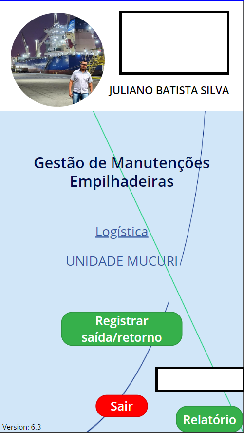
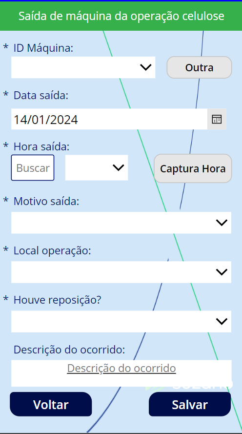
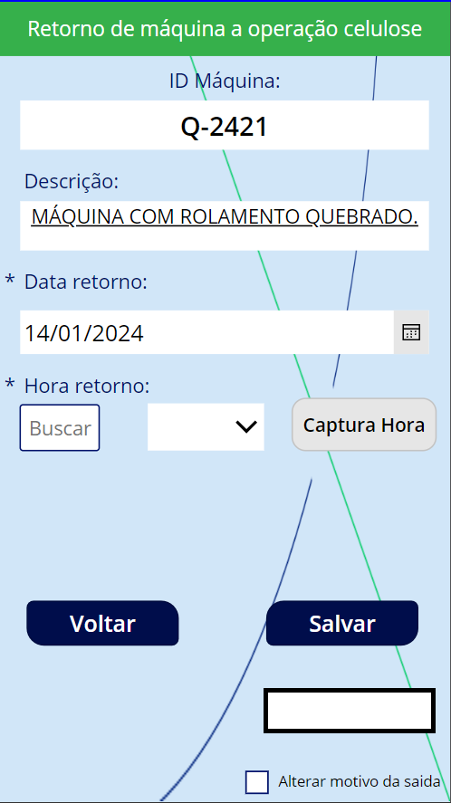

# PowerApps - Gestão de Máquinas e Caminhões

## Visão Geral

O aplicativo de Gestão de Máquinas e Caminhões, desenvolvido no PowerApps, proporciona um sistema eficiente para registrar a saída e retorno de veículos da área operacional. Com a capacidade de rastrear períodos de manutenção, o aplicativo visa otimizar a gestão de frota, permitindo um controle preciso do tempo que cada maquinário passa fora de atividade.

## Observações Importantes

Para uma utilização eficiente do aplicativo, observe as seguintes recomendações:

- **Conexão com Banco de Dados:**
  - Configurar uma conexão com um banco de dados é fundamental para armazenar informações sobre a movimentação e manutenção dos veículos. Certifique-se de ajustar as configurações antes de começar a utilizar o aplicativo.

- **Requisitos de Acesso:**
  - Faça login com as credenciais fornecidas pela equipe de TI para garantir a segurança e integridade dos dados.

## Funcionalidades Principais

1. **Registro de Saída e Retorno:**
   - Permite aos usuários registrar a saída e retorno de máquinas e caminhões, proporcionando uma visão clara da disponibilidade dos veículos.

2. **Controle de Manutenção:**
   - Registre quando um veículo entra em manutenção, incluindo a data de início e previsão de retorno, para melhor planejamento operacional.

3. **Acompanhamento de Tempo Fora de Atividade:**
   - Facilita o acompanhamento do tempo que cada veículo passa fora de atividade, seja por manutenção ou outras razões.

## Como Usar

1. **Login:**
   - Faça login utilizando as credenciais fornecidas pela equipe de TI.

2. **Registro de Saída e Retorno:**
   - Registre cada saída e retorno dos veículos, especificando datas e motivos.

3. **Controle de Manutenção:**
   - Ao programar manutenções, registre as informações relevantes para um gerenciamento eficaz.

4. **Acompanhamento de Tempo Fora de Atividade:**
   - Utilize as funcionalidades do aplicativo para acompanhar o tempo que cada veículo fica fora de atividade.

## Requisitos do Sistema

- Navegador da web moderno
- Conexão com a internet para atualizações em tempo real
- Credenciais fornecidas pela equipe de TI para acesso

## Capturas de Tela
>Home\

>Saída\

>Listando equipamentos\

>Retorno\

